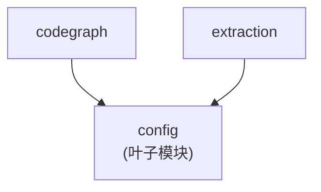

# `pycodegraph.config` 模块依赖约束

> 最后更新: 2026-06-02

## 1. 模块职责

`pycodegraph.config` 负责项目管理配置：

- `CodeGraphConfig` 数据类（version、root 目录、数据库 URL、include/exclude glob 模式、语言列表、max_file_size、docstring 提取标志、call-site 跟踪标志）
- `.codegraph` 目录 / 配置文件 / 数据库文件的路径工具函数
- 配置序列化（通过 JSON 的 save/load）
- 默认配置创建
- 从显式 `config.db_url` 或本地 SQLite 回退解析 SQLAlchemy 数据库 URL

**config 不负责**：数据库操作、代码解析、搜索逻辑。

## 2. 文件结构与内部依赖

```
config.py    # 单文件模块（非包目录），包含 CODEGRAPH_DIR 常量、CodeGraphConfig 数据类、
             # get_config_path(), get_db_path(), get_db_url(),
             # save_config(), load_config(), create_default_config()
```

单文件模块，无内部文件间依赖。

## 3. 对外依赖（config 导入什么）

| 来源 | 导入符号 | 用途 |
|---|---|---|
| `json` | `json` | JSON 序列化/反序列化 |
| `dataclasses` | `asdict`, `dataclass`, `field` | 数据类定义与序列化 |
| `pathlib` | `Path` | 文件系统路径处理 |

config 仅依赖 Python 标准库，无任何项目内依赖。

## 4. 被依赖（谁导入 config）

| 消费者 | 导入的符号 |
|---|---|
| `codegraph.py` | `CODEGRAPH_DIR`, `CodeGraphConfig`, `create_default_config`, `get_db_url`, `load_config`, `save_config` |
| `extraction/orchestrator.py` | `CodeGraphConfig` |
| `tests/test_lifecycle.py` | `CODEGRAPH_DIR`, `get_db_url` |
| `tests/test_inferdb_queries.py` | `CodeGraphConfig` |
| `tests/test_open_from_url.py` | `get_db_url` |

## 5. 约束（Constrains）

### C1: config 是叶子模块，禁止导入项目内任何其他模块🔒

```
config 不得导入 db, types, codegraph, context, extraction, graph, resolution, search, integrations
```


🔒 契约：`config-no-internal-imports`（配置见 `.importlinter`）

### C2: config 仅包含配置定义与持久化，不含业务逻辑

模块职责限于：配置数据类定义、JSON 持久化、路径解析。不涉及 I/O（配置 JSON 除外）、数据库交互或业务逻辑。

### C3: 前向兼容反序列化

`load_config()` 过滤未知键（`k in CodeGraphConfig.__dataclass_fields__`），使配置文件中的额外/废弃字段不会导致加载错误。

### C4: CODEGRAPH_DIR 常量集中管理

`.codegraph` 目录名由 `CODEGRAPH_DIR` 常量集中定义，全代码库通过此常量引用，避免硬编码散布。

## 6. 依赖图（当前状态）



**关键约束方向**: 所有箭头指向 config（上游 → config），config ✗→ 任何项目内模块。
