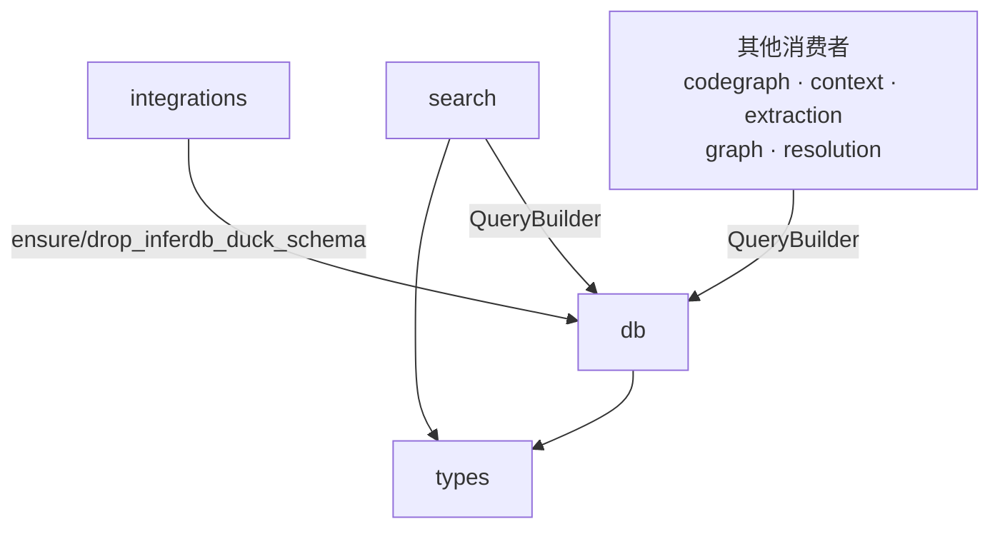

# `pycodegraph.db` 模块依赖约束

> 最后更新: 2026-06-02

## 1. 模块职责

`pycodegraph.db` 是持久层，负责：

- 数据库连接生命周期管理（`DatabaseConnection`）
- Backend 抽象接口与注册表，含延迟注册机制（`backend.py`）
- SQLAlchemy Core 表定义（`tables.py`）
- 内置后端实现 — SQLite / PostgreSQL / InferDB（`backends/`）
- 通用数据查询与写入（`QueryBuilder`）
- LRU 缓存（`_cache.py`）

**db 不负责**：搜索策略选择、评分算法、查询文本解析。这些由 `pycodegraph.search` 模块承担。

## 2. 文件结构与内部依赖

```
db/
├── __init__.py       # DatabaseConnection, prepare_engine_url, resolve_backend_name, metadata（re-exports）
├── _cache.py         # LRUCache[T]（包内私有）
├── backend.py        # Backend ABC + 注册表（延迟注册）+ resolve/prepare
├── tables.py         # 表定义，无内部导入
├── queries.py        # 导入 _cache, backend, tables, ..types
└── backends/
    ├── __init__.py   # 导入并注册三个内置后端
    ├── sqlite.py     # SQLiteBackend（schema + query dialect）
    ├── postgresql.py # PostgreSQLBackend
    └── inferdb.py    # InferDBBackend + ensure/drop_inferdb_duck_schema + 私有工具函数
```

内部依赖方向（必须单向，禁止循环）：

```
backend.py ──→ backends/*（通过延迟注册 get_backend 按需加载）
    │
tables ──→ queries ←── _cache
__init__ ──→ backend, tables
```

## 3. 对外依赖（db 导入什么）

| 来源 | 导入符号 | 用途 |
|---|---|---|
| `..types` | `Edge`, `EdgeKind`, `FileRecord`, `Language`, `Node`, `NodeKind`, `UnresolvedReference` | 行↔域对象转换 |

`types` 是项目内最底层的纯数据模块，无外部依赖，db 依赖它是安全的。

## 4. 被依赖（谁导入 db）

| 消费者 | 导入的符号 |
|---|---|
| `codegraph.py` | `DatabaseConnection`（从 `db`）, `QueryBuilder`（从 `db.queries`） |
| `context/builder.py` | `QueryBuilder` |
| `extraction/orchestrator.py` | `QueryBuilder` |
| `graph/queries.py` | `QueryBuilder` |
| `graph/traversal.py` | `QueryBuilder` |
| `resolution/resolver.py` | `QueryBuilder` |
| `search/searcher.py` | `QueryBuilder`（TYPE_CHECKING 延迟导入） |
| `integrations/inferdb.py` | `ensure_inferdb_duck_schema`, `drop_inferdb_duck_schema`（从 `db.backends.inferdb`） |

## 5. 约束（Constrains）

### C1: 🔒 db 禁止反向依赖上层业务模块

```
db 不得导入 search, context, extraction, graph, resolution, integrations
```

🔒 契约：`db-no-business-imports`（配置见 `.importlinter`）

### C2: QueryBuilder 只提供数据原语，不承担搜索编排

`QueryBuilder` 的搜索相关方法仅返回原始数据，不做策略选择和评分：

| 方法 | 返回值 | 说明 |
|---|---|---|
| `search_fts()` | `list[tuple]` | FTS 原始行 + 分数 |
| `search_like()` | `list[tuple]` | LIKE 原始行 + 分数 |
| `search_by_filters()` | `list[tuple]` | 按种类/语言过滤的原始行 |
| `find_exact_name_files(name, kinds=None)` | `set[str]` | 精确名称匹配的文件路径，可选按 kinds 过滤 |
| `find_nodes_by_name_substring(substring, kinds=None, languages=None, limit=30, exclude_prefix=False)` | `list[Node]` | LIKE 子串匹配的节点列表，支持 kinds/languages/limit/exclude_prefix 参数 |
| `get_all_node_names()` | `list[str]` | 所有去重节点名 |

搜索编排（FTS→LIKE→fuzzy 回退、多信号评分）由 `search.NodeSearcher` 承担，它持有 `QueryBuilder` 引用来调用上述原语。

### C3: Backend 子类统一管理后端特化行为，延迟注册

扩展新后端只需：

1. 继承 `Backend`，实现所有 `@abstractmethod`
2. 用 `@register_backend` 注册
3. 在 `backends/__init__.py` 中添加导入（触发注册），或依赖 `get_backend()` 的延迟注册自动加载 `pycodegraph.db.backends.<name>`
4. 不需要修改 `__init__.py`、`queries.py` 中的任何分发逻辑

`get_backend()` 支持延迟注册：当请求的后端名不在注册表中时，自动尝试 `importlib.import_module(f".backends.{name}", __package__)`，这会触发该后端模块的 `@register_backend` 装饰器。

`ensure_inferdb_duck_schema` 和 `drop_inferdb_duck_schema` 是纯 schema 操作，作为 `InferDBBackend` 的 `@staticmethod` 实现，同时作为模块级函数供 `integrations/inferdb.py` 直接从 `db.backends.inferdb` 导入。

### C4: backends/inferdb.py 中的私有工具函数

`backends/inferdb.py` 中以 `_` 前缀命名的函数（`_duck_identifier`、`_raw_driver_execute`、`_exec_raw_driver_sql`、`_sql_string_literal`）是 InferDB 后端的内部实现，不属于稳定接口。`integrations/inferdb.py` 仅从 `db.backends.inferdb` 导入公开函数 `ensure_inferdb_duck_schema` 和 `drop_inferdb_duck_schema`，不导入任何私有工具函数。

## 6. 依赖图（当前状态）



**关键约束方向**: db → types（单向），db ← search（被依赖），db ← integrations（被依赖），db ✗→ search/context/extraction/graph/resolution/integrations（禁止反向）。
