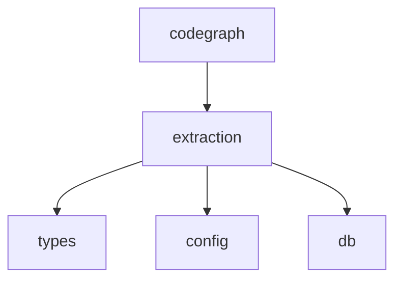

# `pycodegraph.extraction` 模块依赖约束

> 最后更新: 2026-06-02

## 1. 模块职责

`pycodegraph.extraction` 负责源代码解析与符号抽取：

- 使用 tree-sitter AST 解析源代码文件
- 基于每语言配置策略从解析树提取代码符号（节点、边、未解析引用）
- 编排完整索引管道：目录扫描、文件解析、基于内容哈希的增量变更检测、批量数据库存储

**extraction 不负责**：引用解析（由 `resolution` 承担）、搜索编排、图遍历。

## 2. 文件结构与内部依赖

```
extraction/
├── __init__.py            # re-export ExtractionOrchestrator
├── extractor.py           # TreeSitterExtractor — 核心访问者，按语言配置分派
├── grammars.py            # 语言检测（EXTENSION_MAP）、tree-sitter 语法加载与缓存
├── helpers.py             # 工具函数：generate_node_id, get_node_text, 等
├── orchestrator.py        # ExtractionOrchestrator — 索引管道编排
└── languages/
    ├── __init__.py        # EXTRACTORS 注册表：Language → LanguageExtractor 映射
    ├── base.py            # LanguageExtractor dataclass（策略配置 schema）
    ├── go.py              # GO_EXTRACTOR + 钩子函数
    ├── java.py            # JAVA_EXTRACTOR + 钩子函数
    ├── python.py          # PYTHON_EXTRACTOR + 钩子函数
    ├── rust.py            # RUST_EXTRACTOR + 钩子函数
    └── typescript.py      # TYPESCRIPT_EXTRACTOR + JS/JSX/TSX 别名 + 钩子函数
```

内部依赖方向（必须单向，禁止循环）：

```
orchestrator.py ──→ extractor.py ──→ grammars.py
       │                  ├──────→ helpers.py
       │                  └──────→ languages/__init__.py ──→ languages/base.py
       │                                                     ├────→ languages/go.py
       │                                                     ├────→ languages/java.py
       │                                                     ├────→ languages/python.py
       │                                                     ├────→ languages/rust.py
       │                                                     └────→ languages/typescript.py
       ├──────→ grammars.py
       └──────→ helpers.py（通过 extractor 传递）

语言模块严格为叶子节点：仅导入 base.py、helpers.py、...types 和 tree_sitter，绝不向上依赖 extractor/orchestrator/grammars。
```

## 3. 对外依赖（extraction 导入什么）

| 来源 | 导入符号 | 用途 |
|---|---|---|
| `types` | `Edge`, `EdgeKind`, `ExtractionError`, `ExtractionResult`, `Language`, `Node`, `NodeKind`, `UnresolvedReference` | 核心域类型（extractor.py） |
| `types` | `NodeKind` | 节点类型枚举（helpers.py） |
| `types` | `Language` | 语言枚举（grammars.py、languages/__init__.py、languages/go.py） |
| `types` | `FileRecord`, `IndexResult` | 数据库记录类型（orchestrator 用） |
| `config` | `CodeGraphConfig` | 项目配置（include/exclude 模式、max_file_size） |
| `db.queries` | `QueryBuilder` | 批量插入节点/边/引用/文件记录 |
| `tree_sitter` | `Node` (as TSNode), `Tree` | Tree-sitter AST 节点与解析树（extractor.py、helpers.py、所有语言模块） |
| `tree_sitter` | `Language` (as TSLanguage), `Parser` | Tree-sitter 语法加载与解析器创建（grammars.py，懒加载） |

## 4. 被依赖（谁导入 extraction）

| 消费者 | 导入的符号 |
|---|---|
| `codegraph.py` | `ExtractionOrchestrator`（从包级别 `from .extraction import ExtractionOrchestrator`） |

extraction 通过 `__init__.py` re-export `ExtractionOrchestrator`，消费者从包级别导入，无需定位子模块。其他模块均为内部实现细节。

## 5. 约束（Constrains）

### C1: 🔒 extraction 禁止反向依赖上层业务模块

```
extraction 不得导入 codegraph, context, graph, resolution, search, integrations
```


🔒 契约：`extraction-no-business-imports`（配置见 `.importlinter`）

### C2: 策略/配置模式 — LanguageExtractor 是 dataclass 而非 ABC

每个语言提供一个 `LanguageExtractor` 配置实例，将 AST 节点类型映射到抽取类别，附带可选 `Callable` 钩子。`TreeSitterExtractor` 是单一访问者，基于这些配置分派——无需每语言子类化。

扩展新语言只需：
1. 创建新的语言模块文件
2. 在 `languages/__init__.py` 的 `EXTRACTORS` 字典中添加条目
3. 不需要修改 `extractor.py`、`orchestrator.py` 中的任何分发逻辑

### C3: 语言模块严格为叶子节点

`go.py`, `java.py`, `python.py`, `rust.py`, `typescript.py` 仅导入 `.base`（LanguageExtractor）、`...extraction.helpers`（工具函数）、`...types`（NodeKind/Language 等域类型）和 `tree_sitter`（TSNode 类型标注），绝不导入 `extractor.py`、`orchestrator.py`、`grammars.py`——无向上依赖进入访问者或管道层。

### C4: 单一公开入口点，通过包级别 re-export 访问

外部消费者仅导入 `ExtractionOrchestrator`，且通过 `from pycodegraph.extraction import ExtractionOrchestrator` 包级别导入（由 `__init__.py` re-export）。其他所有模块（extractor、grammars、helpers、language 模块）均为内部实现细节。

### C5: __init__.py re-export 公开 API

extraction 包在 `__init__.py` 中 re-export `ExtractionOrchestrator`，确保消费者无需直接定位 `orchestrator` 子模块。`__all__` 列表仅包含 `["ExtractionOrchestrator"]`。

### C6: 语法封装

`grammars.py` 封装所有 tree-sitter `Language`/`Parser` 初始化和缓存。`Language` 和 `Parser` 在函数体内懒加载导入（`get_language` 和 `get_parser`），模块其余部分不直接处理 tree-sitter 设置细节。

### C7: 批量处理与增量索引

orchestrator 使用 `_BATCH_SIZE=200` 进行批量数据库操作，检查内容哈希跳过未变更文件，避免冗余重解析。

### C8: JS/JSX/TSX 共享 TYPESCRIPT_EXTRACTOR

`JAVASCRIPT_EXTRACTOR`、`JSX_EXTRACTOR`、`TSX_EXTRACTOR` 是 `TYPESCRIPT_EXTRACTOR` 的简单别名，共享同一个配置对象实例。

## 6. 依赖图（当前状态）



**关键约束方向**: extraction → types/config/db（单向），extraction ✗→ codegraph/context/graph/resolution/search/integrations（禁止反向）。
