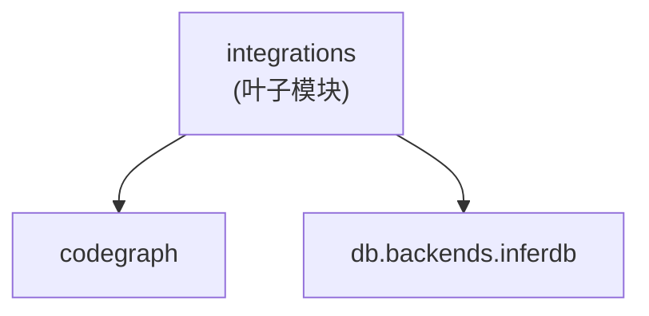

# `pycodegraph.integrations` 模块依赖约束

> 最后更新: 2026-06-02

## 1. 模块职责

`pycodegraph.integrations` 负责第三方集成助手：

- **InferDB 集成**（`inferdb.py`）：管理 InferDB 数据库生命周期，包括 MySQL 数据库创建/删除、DuckDB schema 管理（`ltmdb_sql.<database>`）、URL 构造（带 `?backend=inferdb` 标记）
- 将 InferDB 基础设施桥接到 CodeGraph 的 `init` / `open_from_url` 入口点

**integrations 不负责**：核心图操作、搜索、解析。它是一个胶水层/门面。

## 2. 文件结构与内部依赖

```
integrations/
├── __init__.py    # 包标记，docstring 'Third-party integrations for CodeGraph.'，无导出
└── inferdb.py     # InferDBCodeGraphBackend 类 + _mysql_identifier 私有工具函数
```

无内部依赖。`__init__.py` 不导入 `inferdb.py`，`inferdb.py` 无包内导入。两个文件相互独立。

## 3. 对外依赖（integrations 导入什么）

| 来源 | 导入符号 | 用途 |
|---|---|---|
| `collections.abc` | `Callable` | 构造器注入工厂参数的类型注解 |
| `os` | `getenv` | `from_env()` 读取环境变量 |
| `sqlalchemy` | `Engine`, `create_engine`, `text` | MySQL 数据库管理 |
| `sqlalchemy.engine` | `URL` | 构造带 backend=inferdb 的数据库 URL |
| `codegraph` | `CodeGraph` | 调用 `CodeGraph.init()` 和 `CodeGraph.open_from_url()`（通过 `codegraph_factory` 注入） |
| `db.backends.inferdb` | `drop_inferdb_duck_schema`, `ensure_inferdb_duck_schema` | 管理 DuckDB schema |

## 4. 被依赖（谁导入 integrations）

| 消费者 | 导入的符号 |
|---|---|
| `tests/test_inferdb_queries.py` | `InferDBCodeGraphBackend` |

integrations 是依赖图中的叶子模块——src/ 内无其他模块导入它。

## 5. 约束（Constrains）

### C1: integrations 是叶子模块，禁止被核心业务模块反向依赖

```
db, config, types, context, extraction, graph, resolution, search 不得导入 integrations
```

注意：codegraph 可被 integrations 导入（这是允许的，见 C2）。


🔒 契约：`integrations-no-reverse-deps`（配置见 `.importlinter`）

### C2: Bridge/Facade 模式

`InferDBCodeGraphBackend` 作为门面，将 InferDB 生命周期细节（MySQL DDL、DuckDB schema、URL 构造）封装在简单 API 背后，将 schema 工作委托给 `db.backends.inferdb`，将图初始化委托给 `CodeGraph`。

### C3: 依赖方向严格向外

integrations 依赖 `db.backends.inferdb` 和 `codegraph`；两者都不反向依赖 integrations。

### C4: __init__.py 不 re-export

integrations 包不重新导出 `InferDBCodeGraphBackend`；消费者必须直接从 `pycodegraph.integrations.inferdb` 导入。

### C5: 私有工具函数约定

`_mysql_identifier` 是模块级私有函数（下划线前缀），仅在 `inferdb.py` 内部使用，用于 SQL 标识符安全。

### C6: 可注入工厂参数

`InferDBCodeGraphBackend.__init__` 接受两个可注入的工厂参数：

- **`engine_factory`**（`Callable[[str], Engine]`，默认 `create_engine`）：允许测试注入自定义 `Engine` 创建器，与真实 SQLAlchemy 引擎创建解耦。
- **`codegraph_factory`**（`type[CodeGraph]`，默认 `CodeGraph`）：允许测试注入自定义 `CodeGraph` 子类或 mock，与真实 `CodeGraph` 解耦。

两个工厂均在构造时保存为实例属性（`_engine_factory`、`_codegraph_factory`），在 `init_codegraph` / `open_codegraph` 等方法中使用。

### C7: 环境变量配置

`from_env()` 类方法读取环境变量，支持 12-factor 应用配置。方法接受 `prefix` 参数（默认 `"INFERDB_"`），用于构造环境变量名：`{prefix}HOST`、`{prefix}PORT`、`{prefix}USER`、`{prefix}PASSWORD`（含合理默认值）。

## 6. 依赖图（当前状态）



**关键约束方向**: integrations → codegraph/db.backends.inferdb（单向），核心模块 ✗→ integrations（禁止反向）。
