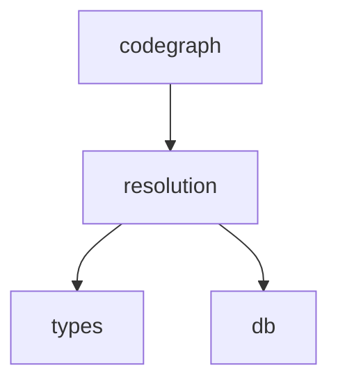

# `pycodegraph.resolution` 模块依赖约束

> 最后更新: 2026-06-02

## 1. 模块职责

`pycodegraph.resolution` 负责将 `UnresolvedReference` 记录转换为具体的 `Edge` 行：

- 基于导入路径解析（`import_resolver.py`）
- 基于名称匹配（`name_matcher.py`）：文件路径匹配、限定名匹配、方法调用匹配、精确名称匹配、模糊匹配
- 语言特定内置/外部符号检测（`builtins.py`）
- 核心编排引擎（`resolver.py`）：内存节点索引、单次查询预热、LRU 缓存、边类型提升、解析并持久化

这是索引管道的第二阶段：extraction 产生未解析引用，resolution 将其匹配到实际符号定义。

**resolution 不负责**：代码解析（由 `extraction` 承担）、搜索编排、图遍历。

## 2. 文件结构与内部依赖

```
resolution/
├── __init__.py          # 公开 API：re-export ReferenceResolver, create_resolver
├── _types.py            # 内部数据结构：UnresolvedRef, ResolvedRef, ResolutionResult, ImportMapping
├── builtins.py          # 语言特定内置符号检测 + is_builtin_or_external()
├── import_resolver.py   # 导入路径解析 + import 映射提取
├── name_matcher.py      # 五级名称匹配策略
└── resolver.py          # 核心编排引擎：ResolutionContext + ReferenceResolver
```

内部依赖方向（必须单向，禁止循环）：

```
__init__.py ──→ resolver.py（ReferenceResolver, create_resolver）

resolver.py ──→ builtins.py（is_builtin_or_external）
           ├────→ import_resolver.py（extract_import_mappings, resolve_via_import）
           ├────→ name_matcher.py（match_reference）
           └────→ _types.py（ImportMapping, ResolutionResult, ResolvedRef, UnresolvedRef）

builtins.py ──→ _types.py（UnresolvedRef）
import_resolver.py ──→ _types.py（ImportMapping, ResolvedRef, UnresolvedRef）
                  └──[TYPE_CHECKING]──→ resolver.py（ResolutionContext）
                  └──[LAZY]──→ ..types.NodeKind（_find_exported_symbol 内部延迟导入）
name_matcher.py ──→ _types.py（ResolvedRef, UnresolvedRef）
               └──[TYPE_CHECKING]──→ resolver.py（ResolutionContext）

_types.py 无内部依赖（叶子节点，仅依赖 ..types.EdgeKind）
```

`TYPE_CHECKING` 守卫防止循环导入：`import_resolver.py` 和 `name_matcher.py` 仅在类型检查时导入 `ResolutionContext`，运行时不导入。

`import_resolver.py` 中 `NodeKind` 采用延迟导入（在 `_find_exported_symbol` 函数体内部 `from ..types import NodeKind`），因为该函数仅在有命名空间导入匹配时才被调用，避免了模块级不必要的导入开销。

## 3. 对外依赖（resolution 导入什么）

| 来源 | 导入符号 | 用途 |
|---|---|---|
| `types` | `EdgeKind` | _types.py 中 UnresolvedRef.reference_kind 字段 |
| `types` | `Node` | import_resolver/name_matcher 返回类型与候选操作 |
| `types` | `NodeKind` | name_matcher 种类过滤（FILE, CLASS, METHOD, FUNCTION, STRUCT, INTERFACE 等）；import_resolver 中延迟导入 |
| `types` | `Edge`, `EdgeKind`, `Node`, `NodeKind`, `UnresolvedReference` | resolver.py 边创建、节点查找、类型提升 |
| `db.queries` | `QueryBuilder` | get_all_nodes(), get_all_unresolved_refs(), insert_edges(), delete_all_unresolved_refs() |

## 4. 被依赖（谁导入 resolution）

| 消费者 | 导入的符号 |
|---|---|
| `codegraph.py` | `create_resolver` |
| `tests/test_inferdb_queries.py` | `create_resolver` |

## 5. 约束（Constrains）

### C1: resolution 禁止反向依赖上层业务模块 🔒

```
resolution 不得导入 codegraph, context, extraction, graph, search, integrations
```


🔒 契约：`resolution-no-business-imports`（配置见 `.importlinter`）

### C2: resolution 是管道终端阶段

resolution 依赖 extraction 的输出（数据库中的 `UnresolvedReference` 行），永远不反馈到 extraction 或解析。

### C3: TYPE_CHECKING 守卫防止循环导入

`import_resolver.py` 和 `name_matcher.py` 仅在 `if TYPE_CHECKING` 下导入 `ResolutionContext`，因为 `resolver.py` 在运行时从它们导入。这是防止循环导入的标准模式。

### C4: ResolutionContext 单次查询预热

`ResolutionContext` 使用 `warm_caches()` 策略：所有节点通过一次 SELECT 加载到内存字典中，之后所有查找均为 O(1) 字典操作，零数据库查询。

### C5: LRU 有界缓存

import 映射（5000 条）和文件内容（1000 条）使用 LRU 缓存限制内存；节点索引无上限（一次性加载）。

### C6: 置信度评分

每个已解析引用携带 float 置信度（0.3–0.95）和 `resolved_by` 方法字符串，支持下游按质量过滤。

### C7: 边类型提升

resolver 将 `CALLS` 提升为 `INSTANTIATES`（目标为 CLASS/STRUCT 时），将 `EXTENDS` 提升为 `IMPLEMENTS`（目标为 INTERFACE/PROTOCOL/TRAIT 时）。

### C8: 公开表面最小

`__all__` 仅暴露 `ReferenceResolver` 和 `create_resolver`。所有其他符号（_types、匹配函数、内置集）均为内部。

### C9: resolve_and_persist 事务性语义

`resolve_and_persist()` 加载所有未解析引用、解析、批量插入边、删除已处理引用（truncate），具有事务性效果。

## 6. 依赖图（当前状态）



**关键约束方向**: resolution → types/db（单向），resolution ✗→ codegraph/context/extraction/graph/search/integrations（禁止反向）。
