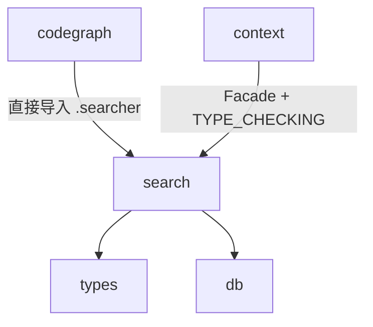

# `pycodegraph.search` 模块依赖约束

> 最后更新: 2026-06-02

## 1. 模块职责

`pycodegraph.search` 负责查询解析、术语提取、评分启发式和多策略节点搜索编排：

- **查询解析**（`query_parser.py`）：字段限定搜索查询解析，支持 `kind:`/`lang:`/`path:`/`name:` 过滤器、带引号保留、Damerau-Levenshtein 编辑距离
- **搜索工具**（`query_utils.py`）：停用词过滤、词干变体、camelCase/snake_case 拆分、路径相关性评分、测试文件检测、名称匹配加分
- **搜索编排**（`searcher.py`）：三策略级联（FTS → LIKE → fuzzy）、精确名同位置提升、多信号评分

search 是唯一的搜索智能层：将原始用户查询转换为结构化过滤器，委托原始数据检索给 `QueryBuilder`，拥有所有排名逻辑。

**search 不负责**：数据存储、图遍历、上下文构建。

## 2. 文件结构与内部依赖

```
search/
├── __init__.py        # Facade：re-export 所有公开符号
├── query_parser.py    # 查询解析 + bounded_edit_distance
├── query_utils.py     # 纯函数：术语提取、评分启发式、停用词
└── searcher.py        # NodeSearcher — 搜索编排器
```

内部依赖方向（必须单向，禁止循环）：

```
__init__.py ──→ query_parser.py, query_utils.py, searcher.py（re-export）
searcher.py  ──→ query_parser.py（bounded_edit_distance, parse_query）
             └──→ query_utils.py（kind_bonus, name_match_bonus, score_path_relevance）

query_parser.py 和 query_utils.py 互不依赖（独立叶子）
```

## 3. 对外依赖（search 导入什么）

| 来源 | 导入符号 | 用途 |
|---|---|---|
| `types` | `Language`, `NodeKind` | query_parser 中 kind:/lang: 过滤器值验证 |
| `types` | `Language`, `NodeKind`, `SearchOptions`, `SearchResult` | searcher 中搜索选项构造、结果对象、过滤器合并 |
| `db.queries` | `QueryBuilder` | searcher 中 TYPE_CHECKING 守卫导入；构造器参数类型和原始数据查询委托 |

## 4. 被依赖（谁导入 search）

| 消费者 | 导入的符号 | 导入方式 |
|---|---|---|
| `codegraph.py` | `NodeSearcher` | 直接从 `.search.searcher` 导入（绕过 Facade） |
| `context/builder.py` | `extract_search_terms`, `get_stem_variants`, `is_test_file` | 从 `..search` 公开 API 导入 |
| `context/builder.py` | `NodeSearcher` | 仅 `TYPE_CHECKING` 下从 `..search.searcher` 导入；运行时通过构造器注入 |

**注入模式**：`NodeSearcher` 现在是单一共享实例，由 `_create_components()` 创建后通过关键字参数分别注入 `CodeGraph` 和 `ContextBuilder`。`ContextBuilder.__init__` 接受 `searcher: NodeSearcher` 参数，不再内部创建 `NodeSearcher`。

## 5. 约束（Constrains）

### C1: search 禁止反向依赖上层业务模块（🔒 已执行）

```
search 不得导入 codegraph, context, extraction, graph, resolution, integrations
```


🔒 契约：`search-no-business-imports`（配置见 `.importlinter`）

### C2: QueryBuilder 使用 TYPE_CHECKING 守卫

`searcher.py` 中 `QueryBuilder` 仅在 `if TYPE_CHECKING` 下导入，避免运行时循环导入。运行时通过构造器参数类型检查和委托调用。

### C3: query_parser.py 和 query_utils.py 是独立叶子

两个模块互不依赖，可独立测试。

### C4: query_utils.py 是纯函数模块

无类、无状态、无 I/O——所有导出均为常量或纯函数。

### C5: 三策略级联是严格回退

FTS → LIKE → fuzzy，每种策略仅在前一种无结果时尝试。

### C6: 多信号评分组合

searcher.py 将三个独立信号（`kind_bonus` + `score_path_relevance` + `name_match_bonus`）加法组合到数据库查询的基础分数之上。

### C7: __init__.py 作为 Facade（存在绕过例外）

重新导出所有公开符号，使外部消费者可 `from pycodegraph.search import X` 而无需了解内部文件布局。

**绕过例外**：`codegraph.py` 直接从 `.search.searcher` 导入 `NodeSearcher`，绕过了 Facade。这是构造器注入模式的需要——`codegraph.py` 需要引用具体类以创建实例和声明参数类型。`context/builder.py` 则遵循 Facade 模式，从 `..search` 公开 API 导入工具函数，`NodeSearcher` 仅在 `TYPE_CHECKING` 守卫下从内部模块导入。

### C8: search 不直接访问数据库

search 模块从不导入 SQLAlchemy 或直接操作 SQL，所有数据访问通过 `QueryBuilder` 委托。

## 6. 依赖图（当前状态）



**关键约束方向**: search → types/db（单向），search ✗→ codegraph/context/extraction/graph/resolution/integrations（禁止反向）。

**注入关系**：`codegraph._create_components()` 创建 `NodeSearcher` 实例，通过构造器注入同时传递给 `CodeGraph` 和 `ContextBuilder`，确保搜索器为单一共享实例。
